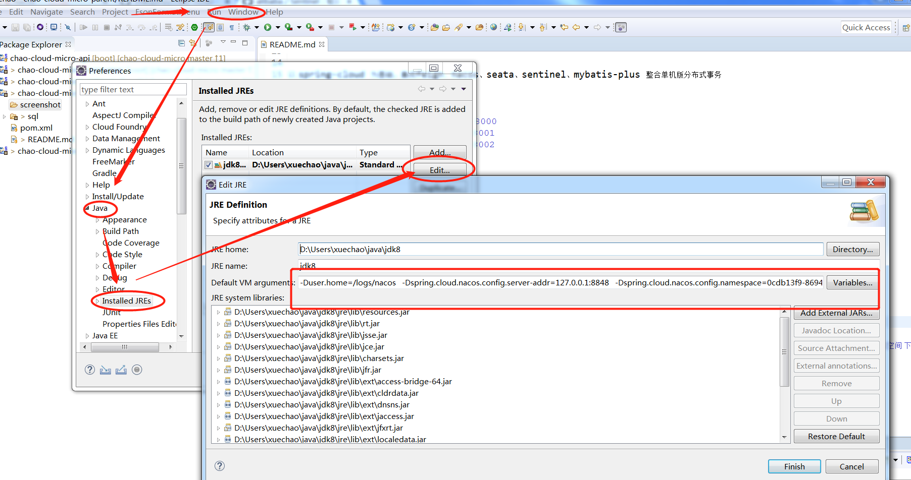
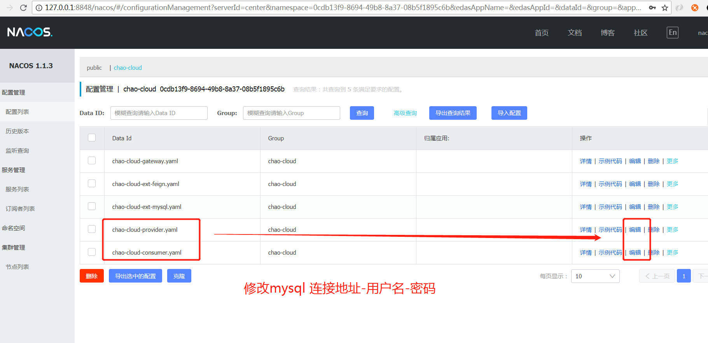
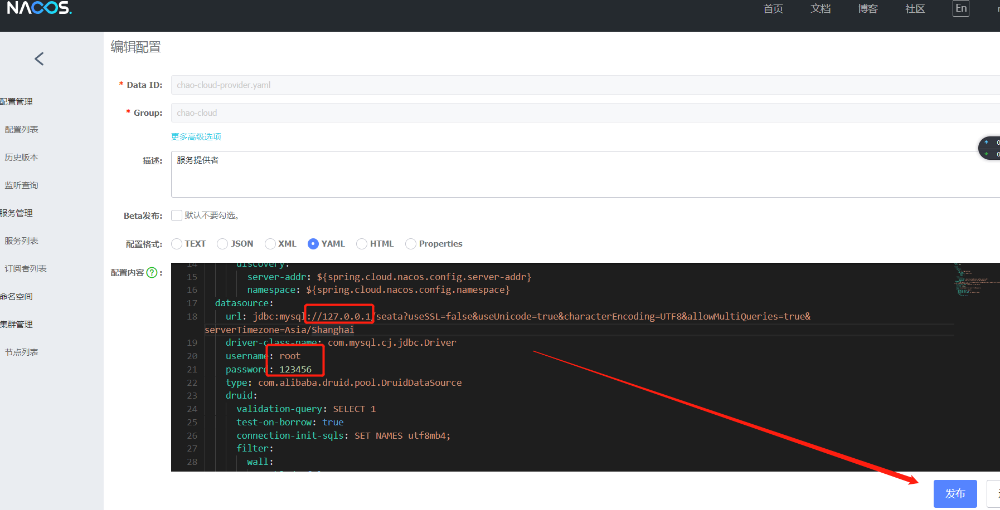

chao-cloud-micro: springcloud feign+nacos+seata+sentinel+mybatis-plus+oauth2+security  
=====

<p>
  <a href="https://github.com/996icu/996.ICU/blob/master/LICENSE">
    
  </a>
  <a href="https://www.apache.org/licenses/LICENSE-2.0">
    
  </a>
</p>

------

以 spring-cloud 为基础，集成feign、nacos、seata、sentinel、mybatis-plus 整合单机版分布式事务，附加oauth2.0+security配置

	chao-cloud-micro
	    ├─api 		//feign接口
	    ├─auth 		//微服务oauth2+security 8003（默认不开启，请在gateway打开过滤器 OAuth2GlobalFilter.class）
	    ├─gateway 		//微服务网关 8000
	    ├─provider 		//服务提供者 8001
	    └─consumer		//服务消费者 8002
		
------  

## Step1-导入sql（mysql）

- 新建数据源 test，导入 sql/test.sql
- 新建数据源 seata，导入 sql/seata.sql
- 新建数据源 nacos，导入 sql/nacos.sql   
	- 注：nacos为微服务配置中心下一步详细介绍
- 新建数据源 oauth2，导入 sql/oauth2.sql   
	- 注：oauth2为微服务接口权限控制，默认不开启，非本章重点，可忽略。

## Step2-配置nacos（[nacos@安装手册](https://nacos.io/zh-cn/docs/quick-start.html)）

##### 1.安装nacos
- [下载nacos-1.1.3版本](https://github.com/alibaba/nacos/releases) ->nacos-server-1.1.3.zip
- 解压、修改 conf/application.properties、新增以下5行配置

```
spring.datasource.platform=mysql
db.num=1
db.url.0=jdbc:mysql://127.0.0.1/nacos?characterEncoding=utf8&connectTimeout=1000&socketTimeout=3000&autoReconnect=true
db.user=root
db.password=123456
```

- 启动nacos
    - Linux/Unix/Mac  
	  - sh startup.sh -m standalone
    - Windows  
	  - 双击startup.cmd运行文件。
- 访问nacos [http://127.0.0.1:8848/nacos](http://127.0.0.1:8848/nacos)
    - 账号：nacos  
    - 密码： nacos

##### 2.配置jvm增加启动参数

```
-Dspring.cloud.nacos.config.server-addr=127.0.0.1:8848   #你的nacos服务地址 
-Dspring.cloud.nacos.config.namespace=0cdb13f9-8694-49b8-8a37-08b5f1895c6b #你的nacos命名空间（这里是 chao-cloud命名空间 下的那个随机字符串）
```


##### 3.修改nacos 配置管理->配置列表->点击chao-cloud 

- chao-cloud-provider.yaml  		 
- chao-cloud-consumer.yaml  		
- chao-cloud-auth.yaml (同上，可忽略)  		





## Step3-配置seata

##### 1.在 [Seata Release](https://github.com/seata/seata/releases) 下载相应版本的 Seata Server 并解压
##### 2.修改 `conf/registry.conf` 配置，将 type 改为 `nacos`

```
registry {
  type = "nacos"

  nacos {
    serverAddr = "127.0.0.1:8848"
    namespace = "public"
    cluster = "default"
  }
}

config {
  type = "nacos"

  nacos {
    serverAddr = "127.0.0.1:8848"
    namespace = "public"
    cluster = "default"
  }
}
```
##### 3.修改 `conf/nacos-config.txt`配置（上述 nacos.sql 中已经导入、可略过此步骤）

修改 `service.vgroup_mapping`为自己应用对应的名称；如果有多个服务，添加相应的配置

如 

```properties
service.vgroup_mapping.my_test_tx_group=default

#改为 

service.vgroup_mapping.chao-cloud-provider-fescar-service-group=default
service.vgroup_mapping.chao-cloud-consumer-fescar-service-group=default
```

也可以在 Nacos 配置页面添加，data-id 为 `service.vgroup_mapping.${YOUR_SERVICE_NAME}-fescar-service-group`, group 为 `SEATA_GROUP`， 如果不添加该配置，启动后会提示`no available server to connect` 

注意配置文件末尾有空行，需要删除，否则会提示失败，尽管实际上是成功的

##### 4.将 Seata 配置添加到 Nacos 中 （上述 nacos.sql 中已经导入、可略过此步骤）

```bash
cd conf
sh nacos-config.sh 127.0.0.1:8848  #127.0.0.1:8848 为你的nacos服务地址
```

成功后会提示

```bash
init nacos config finished, please start seata-server
```

##### 5.在nacos服务  public 命名空间下添加一个配置（上述 nacos.sql 中已经导入、可略过此步骤）
- Data Id： registry.type
- Group： SEATA_GROUP
- 内容为  nacos  格式选txet 

##### 6.启动 Seata Server (windows 请直接点击 bin/seata-server.cmd)

```bash
cd ..
sh ./bin/seata-server.sh -p 8091 -m file
```

启动后在 Nacos 的服务列表下面可以看到一个名为`serverAddr`的服务

## Step4-测试

1. 启动  gateway
2. 启动  provider
3. 启动  consumer
4. http://localhost:8000/chao-cloud-consumer/test?userId=1
5. 查看 seata 数据库的 order表 是否有数据，没有则正确


## 自定义 seata-nacos配置（此步骤可选）
- 项目的nacos配置和  seata的nacos配置可分开 ->请查看seata/conf/registry.conf 

```java
@EnableTxSeata

//yaml 配置
chao:
  cloud:
    tx:
      seata:
        server-addr:  # seata->nacos地址
        namespace: # seata->nacos命名空间  默认 空 
        cluster:   # seata->集群标识  默认 default
```

- 说明
  * 在启动类增加@EnableTxSeata  
  * 目前只支持 nacos+feign+seata

## 注意 

### 1.TxSeataConfig 配置 （原理）

这里是尤其需要注意的，Seata 是通过代理数据源实现事务分支，所以需要配置 `io.seata.rm.datasource.DataSourceProxy` 的 Bean，且是 `@Primary`默认的数据源，否则事务不会回滚，无法实现分布式事务 

```java
@Data
@ConfigurationProperties(EnableTxSeata.TX_SEATA_PREFIX)
public class TxSeataConfig {

	private String serverAddr;
	private String namespace;
	private String cluster;

	@Bean(initMethod = "init")
	@ConditionalOnMissingBean
	@ConfigurationProperties(prefix = "spring.datasource")
	public DruidDataSource druidDataSource() {
		StaticLog.info("初始化-Seata-DruidDataSource");
		return new DruidDataSource();
	}

	@Primary
	@Bean
	@ConditionalOnMissingBean
	public DataSourceProxy dataSource(DataSource dataSource) {
		return new DataSourceProxy(dataSource);
	}

	@Bean
	@ConditionalOnClass(Feign.class)
	public TxSeataFeignProxy TxSeataProxy() {
		return new TxSeataFeignProxy();
	}
}
```

### 2.OAuth 2.0 配置

```java 
<!-- oauth2 已经包含 security -->
<dependency>
	<groupId>org.springframework.cloud</groupId>
	<artifactId>spring-cloud-starter-oauth2</artifactId>
</dependency>
```

- gateway-> OAuth2GlobalFilter 解开注释
- gateway-> OAuth2Properties 配置过滤的路径

```请不要重复
chao:
  cloud:
    oauth2:
      ant-matchers:
      - /health/**
      - /login/**
```
- auth-> AuthorizationServerConfig oauth2认证中心
- auth-> ResourceServerConfig 启用资源服务
- auth-> SecurityConfig Security 权限管理（本项目）
- auth-> MappingAuthProperties 配置路径-> 权限映射

```
chao:
  cloud:
    oauth2:
      mapping-auth: # 这里的@代表 / ，意为 路径:权限
        @chao-cloud-auth@oauth@user: ROLE_USER
```

## 参考
- [nacos参考手册](https://nacos.io/en-us/docs/what-is-nacos.html)
- [helloworlde@seata部署](https://github.com/helloworlde/spring-cloud-alibaba-component/tree/master/cloud-seata-nacos)
- [阮一峰@OAuth2的四种方式](http://www.ruanyifeng.com/blog/2019/04/oauth-grant-types.html)
- [OAuth2授权](https://www.jianshu.com/p/9d0264d27c3b)

------

## 版权

### Apache License Version 2.0  

- 如不特殊注明，所有模块都以此协议授权使用。
- 任何使用了chao-cloud-micro的全部或部分功能的项目、产品或文章等形式的成果必须显式注明chao-cloud-micro。

### NPL (The 996 Prohibited License)

- 不允许 996 工作制度企业使用该开源软件

### 其他版权方
- 实施上由个人维护，欢迎任何人与任何公司向本项目开源模块。
- 充分尊重所有版权方的贡献，本项目不占有用户贡献模块的版权。

### 鸣谢
感谢下列优秀开源项目：
- [nacos@配置注册中心](https://github.com/alibaba/nacos)  
- [seata@分布式事务](https://github.com/seata/seata)  
- [Sentinel@微服务的哨兵](https://github.com/alibaba/Sentinel)  
- [helloworlde@seata-demo](https://github.com/helloworlde/spring-cloud-alibaba-component)  
- [hutool-超级工具类](https://github.com/looly/hutool)  
- [lombok](https://github.com/rzwitserloot/lombok)  
- [mybatis-plus](https://github.com/baomidou/mybatis-plus)  
- [......](https://github.com/)  

感谢诸位用户的关注和使用，chao-cloud-micro并不完善，未来还恳求各位开源爱好者多多关照，提出宝贵意见。

作者 [@chaojunzi 1521515935@qq.com]

2019年9月9日